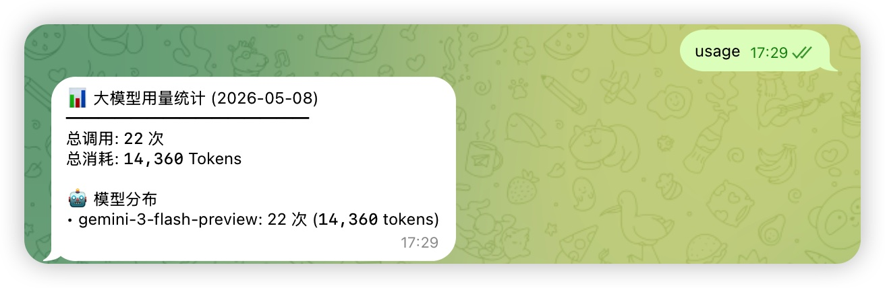
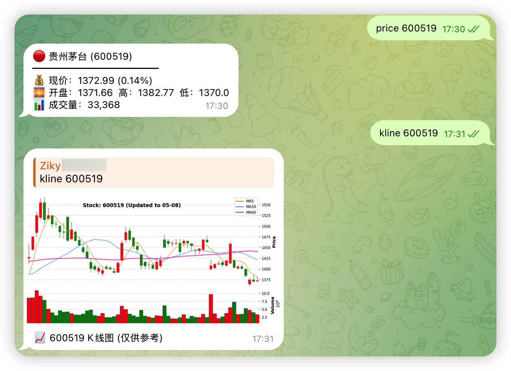

# 📈 Telegram Stock Analysis Bot

**基于 [daily_stock_analysis](https://github.com/ZhuLinsen/daily_stock_analysis) 的 Telegram 股票实时智能分析机器人**

一个轻量、高效的 Telegram Bot，通过调用 `daily_stock_analysis` 项目暴露的 API，在群组或私聊中通过 `@<Your_Bot>` 快速触发个股实时行情、K线图、LLM 驱动的深度分析、大盘复盘等功能。

## ✨ 核心特性

- **实时交互**：在 Telegram 群组中 `@<Your_Bot> 代码/名称` 即可触发分析
- **深度分析**：调用原项目 LLM 能力，生成专业级个股研报式报告
- **可视化支持**：实时价格查询 + K线图生成（含常用技术指标）
- **大盘复盘**：每日/实时市场综述与情绪分析
- **历史管理**：查询使用记录（usage）、历史分析（list）、清理记录（clear）
- **多市场支持**：A股、港股、美股（依赖原项目数据源）
- **低成本部署**：轻量 FastAPI + Python + Telegram Bot 架构

## 📸 使用示例

### 群组

直接在群组内 `@<Your_Bot>`，即会弹出相关操作。

```shell
• @Your_Bot help: 显示帮助菜单
• @Your_Bot usage: 今日大模型 Token 消耗统计
• @Your_Bot list: 查看个股历史分析记录
• @Your_Bot price <代码>: 实时价格行情查询
• @Your_Bot kline <代码>: 获取个股 K 线图
• @Your_Bot clear: 清理个股分析历史记录
• @Your_Bot market_review: 大盘分析任务
• @Your_Bot <代码> <名称>: 个股深度分析
```

### 单聊

如果是机器人私聊则可以忽略@操作，直接触发动作。





## 🚀 快速启动

```shell
# 1. 克隆本仓库
git clone https://github.com/zikysc/tg_stock_bot.git
cd tg_stock_bot

# 2. 复制环境变量模板
cp .env.example .env

# 3. 创建虚拟环境（推荐 Python 3.9+）
python -m venv .venv
source .venv/bin/activate

# 4. 安装依赖
python -m pip install --upgrade pip
pip install -r requirements.txt

# 5. 配置 .env（见下方详细说明）
# 然后启动
python run.py
```
